# ArcGIS Online 上のデータを可視化するための方法

1. [マップを作成する](#マップを作成する)
2. [シンボルを変更する](#シンボルを変更する)
3. [ラベルを変更する](#ラベルを変更する)

## マップを作成する

マップ ビューアー → [追加] → [保存]
緯度経度の情報を持ったCSV ファイルなどを、レイヤーとしてマップに追加し、様々なレイヤーを組み合わせてマップを作成することができます。マップの保存には、コンテンツを作成する権限が必要です（権限を持っていない場合でもマップは作成できますが、保存することはできません）。

1. マップ ビューアーを開きます。
2. [追加]   をクリックします。
3. [レイヤーの検索]、[Living Atlas レイヤーの参照]、[Web からレイヤーを追加]、[ファイルからレイヤーを追加]、[マップ メモの追加] いずれかのレイヤーの追加方法を選択します。

 
それぞれのレイヤー追加方法は、以下の通りです。

### レイヤーの検索
1. [検索] ボックスにキーワードを入力し、[検索] をクリックします。
[検索先] ドロップダウン リストでは、検索する場所を限定することができ、また、[マップ エリア内] のチェックボックスをオンにすると、マップ ビューアーの表示範囲にあるレイヤーを検索することができます。
2. 検索結果は下部のボックス内に表示され、レイヤー名の右にある [追加] をクリックするか❶、レイヤー名をクリックしたのちに❷、[マップに追加] ❸をクリックします。

3. [レイヤーの追加を完了] をクリックし、レイヤーの追加を終了します。

### Living Atlas レイヤーの参照
米国 Esri 社やほかのユーザーが提供する高品質マップ レイヤーをマップに追加します。レイヤーの詳細は、アイテム説明で確認できます。レイヤーによっては、組織向けアカウントでのサイン インが必要であったり、クレジットを消費するものがあります。

### Web からレイヤーの追加
URL を指定して、ArcGIS Server Web サービス、OGC WMS Web サービス、OGC WMTS Web サービス、Web サーバー上にあるタイル レイヤー、KML ファイル、GeoRSS ファイル、および CSV ファイルのレイヤーを追加することができます。

### ファイルからレイヤーを追加
1. [ファイルを選択] をクリックして、コンピューター上のファイル（区切りテキスト ファイル（*.csv または *.txt）、GPS Exchange Format（*.gpx）ファイル、またはシェープファイル（*.zip に圧縮済み））を選択します。
  ~~~~
  この方法で追加できるレイヤーのフィーチャ数の上限は、1,000フィーチャです。1,000フィーチャ以上のデータを持つファイルを追加する場合、[マイ コンテンツ] ページの [アイテムの追加] で行う方法があります。
  ~~~~
  ~~~~
  *.csv、*.txt、*.gpx ファイルをマップ表示エリアへドラッグ ＆ ドロップして追加するには → 13ページ
  ~~~~

2. [レイヤーのインポート] をクリックします。
3. [CSV レイヤーの追加] ダイアログが表示された場合は、緯度/経度あるいは住所の情報を含んでいるフィールドを選択します。[レイヤーの追加] をクリックして、レイヤーの追加を終了します。

### マップ メモの追加
1. [マップ メモの追加] ダイアログで、[名前] フィールドでレイヤー名を、[テンプレート] ドロップダウン リストから任意のマップ メモのテンプレートを選択します。
2. [マップ メモの追加] ダイアログで、名前を入力し、テンプレートをドロップダウン リストから選択して、[作成] をクリックします。
3. フィーチャの追加パネルが表示されるので、マップに追加するシンボルを選択します。
4. マップの任意の位置をクリックすると、その位置にシンボルが表示されると同時にポップアップが開き、タイトルや説明などを入力することができます。
5. コンテンツ パネルでレイヤーが追加されたことを確認し、追加されたレイヤー名にマウス オンするかレイヤー名をクリックし、から [レイヤーの保存] をクリックします。
6. [アイテムの作成] ダイアログでレイヤーのタイトル、タグ、サマリー（説明）を入力し、保存するフォルダーを選択して [アイテムの作成] をクリックします。
  タグを入力して、Enter キーを押すと、入力文字を確定できます。
7. マップを保存するために、[保存] → [保存] をクリックします。
  マップの保存では、マップ ビューアー上で参照しているレイヤーやその表示設定などが保存されます。マップ上で設定したレイヤーのシンボルなどは、レイヤー自体には保存されないため、他のマップでそのレイヤーを追加したときには、再度、シンボルの設定等を行う必要があります。
8. タイトル、タグ、サマリー（説明）を入力し、保存するフォルダーを選択し、[マップの保存]   をクリックします。
9. [マイ コンテンツ] ページに移動し、マップが   のような地図のアイコンで保存されていることを確認できます。

  緯度経度、または住所情報を含むテキスト ファイル（ *.txt、 *.csv）であれば、マップ表示エリアにファイルをドラッグ & ドロップすることで、ポイント フィーチャ レイヤーとしてマップに追加できます。フィールドはカンマ、セミコロン、またはタブで区切る必要があり、その他の区切り文字はサポートされていません。また、緯度経度は、10進度である必要があります。Google Chrome、Mozilla Firefox、Internet Explorer 10以降で利用可能です。

1. 日本語を含むテキストファイルを使用するためには、Windows の「メモ帳」でファイルを開き、[ファイル] メニュー → [名前を付けて保存] をクリックし、[名前を付けて保存] ダイアログの下部に表示される [文字コード] ドロップダウン リストから [UTF-8] を指定して [保存] ボタンをクリックします。

2. 保存したファイルを、マップ ビューアー上にドラッグ & ドロップします。

3． [CSV レイヤーの追加] 画面が表示されます。住所が入力されている場合は、[使用しているフィーチャの特定] では [住所] を指定し、[国] ドロップダウン リストから 「日本」 を選択します。
4． 住所が入力されているフィールド名をクリックし、[場所フィールド] で [住所/大字町丁目以降] を選択します。
5. [レイヤーの追加]  ボタンをクリックします。
 
## シンボルを変更したい

> マップ ビューアー → [詳細] → [コンテンツ] → レイヤー名にマウス オン / クリック → [スタイルの変更]

シンボルの色や形を変更します。コンテンツを作成する権限を持っている場合に可能です。

1. マップ ビューアーの [詳細] が選択されていることを確認し、[コンテンツ] をクリックします。

2. シンボルを変更したいレイヤー名にマウス オン / クリックし、[スタイルの変更] のアイコンをクリックします。

3. [スタイルの変更] パネルが表示されます。

4. [①表示する属性を選択] ドロップダウン リストから、シンボルの設定をする属性フィールドを選択します。
属性値でシンボル設定をしない場合は、[場所のみ表示] を選択します。

5. [②描画スタイルの選択] で、変更したい描画方法の [選択] をクリックします。既に選択されている描画スタイルは [オプション] と表示されます。
> ### 一種類の属性フィールドによるシンボル設定
> #### 場所（単一シンボル）
> 
> 
> すべてのフィーチャを同じシンボルで表現します。
> 
> #### 種類 (個別値シンボル)
> 
> 
> 樹木の種類、道路クラス、都道府県名など、属性のカテゴリごとにシンボルを割り当てて描画します。
> 
> #### 数と量（サイズ）
> 
> 
> 数値またはランク付けされたデータをシンボルの大きさで表現します。データの数値が大きいほど、シンボルの大きさも大きく表示されます。
> 
> #### 数と量（色）
> 
> 
> 数値またはランク付けされたデータを色の濃淡で表現します。データの数値が大きいほど濃い色で、小さいほど淡い色で表示することなどができます。
>
> #### ヒート マップ
> 
> 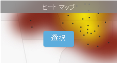
> ポイントが集中しているエリアを一目で確認できるような表現ができます。
> 
> ### 日付データによるシンボル設定
> 
> 属性フィールドに日付データを含むフィールドを選択すると、時系列データのスタイルの変更が提示されます。
> 
> #### 連続タイムライン（サイズ）
> 
> 
> 日付データをシンボルの大きさで表現します。新しい日付から古い日付をシンボルの大きさで表示することができます。
> 
> #### 連続タイムライン（色）
> 
> 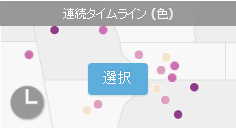
> 日付データを色の濃淡で表現します。新しい日付から古い日付を濃い色から薄い色で表示することなどができます。また、特定の日付の前後で色を変えることもできます。
> 
> #### 期間（サイズ）
> 
> 
> 設定した開始と終了日の期間の長さをシンボルの大きさで表現します。期間が長いほどシンボルの大きさも大きく表示されます。
> 
> #### 期間（色）
> 
> 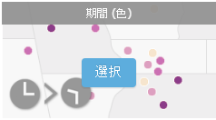
> 設定した開始と終了日の期間の長さを色の濃淡で表現します。期間の長さを濃淡で表現したり、所定日の前後で色を変える設定ができます。
> 
> ※レイヤーが持つ属性フィールドのタイプに応じて選択できる種類が異なります。例えば、文字列型のフィールドのみで構成されるレイヤーでは、[種類] ドロップダウン リストでサイズや色の指定はできません。

6.	[オプション] をクリックすると、シンボルの詳細な設定をすることができます。

> #### 場所（単一シンボル）の場合
> 
> 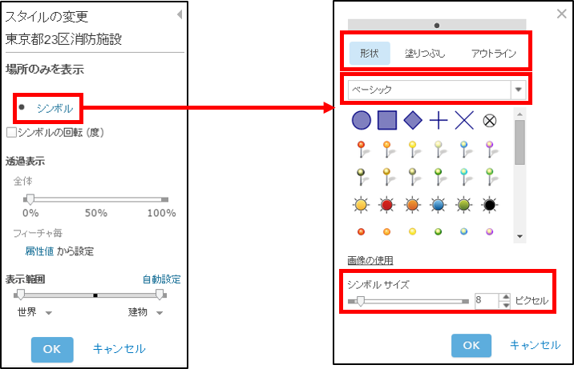
> [シンボル] をクリックし、形状や大きさ、塗りつぶし色、アウトラインの設定などを行います。
> 
> #### 種類（個別値シンボル）の場合
> 
> 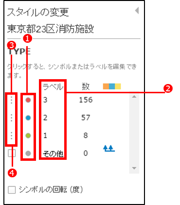
> 
> - ❶ 各シンボルの形状や大きさ、塗りつぶし色、アウトラインの設定などを行うことができます。
> - ❷ 凡例で表示するラベル名を直接入力して変更することができます。
> - ❸ ドラッグし、目的の位置でドロップすることで、各シンボルの順序を変更できます。
> - ❹ チェックボックスをオンにすると、シンボルが設定されている値以外の図形（例えば、属性値が入力されていない図形）が「その他」として表示されます。
> ※個別値が11種類以上ある場合は、一部のデータが「その他」にグループ化されます。ラベル欄の「その他」の右にある       をクリックすると、一括してグループ化を解除できます。また、「その他」の中にはグループ化された個別値が表示され、各個別値の    をクリックすることで、個々にグループから除外することもできます。
> 
> #### 数と量（サイズ）の場合
> 
> 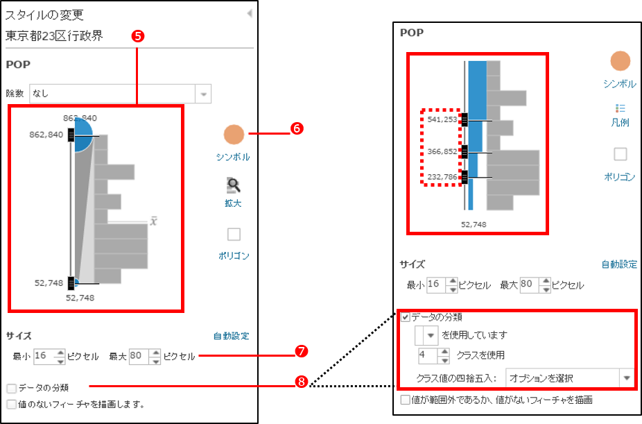
> 
> - ❺ スライダーの上部、下部のバーを動かして、最大 / 最小クラスの閾値を変更できます。また、数値をクリックして、直接入力することもできます。
> - ❻ ポイントのシンボルを変更できます。
> - ❼ 最小/最大クラスのポイントのサイズを変更できます。
> - ❽ チェックボックスをオンにすると、クラスの分類数や分類方法、各クラスの閾値を設定することができます。各クラスの閾値は、スライダーを動かして変更するか、クラスの閾値の数値をクリックして、直接、入力することもできます❾。
> 
> #### 数と量（色）の場合
> 
> 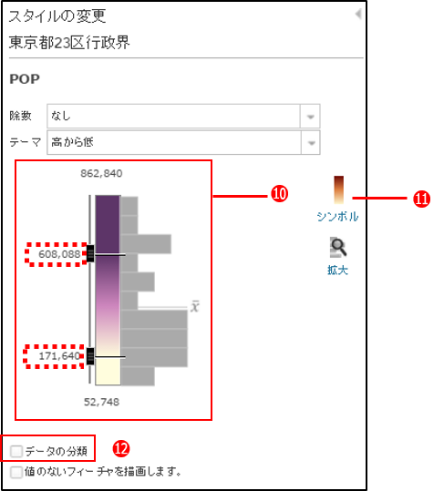
> 
> - ❿ スライダーの上部、下部のバーを動かして、最小/ 最大クラスの閾値を変更できます。また、数値をクリックして、直接入力することもできます。
> - ⓫ ここをクリックすることで、色のパターンなどを変更できます。
> - ⓬ チェックボックスをオンにすると、クラスの分類数や分類方法、各クラスの閾値を設定することができます。設定方法は「数と量（サイズ）（16ページ）」をご参照ください。
> 
> #### ヒートマップの場合
> 
> 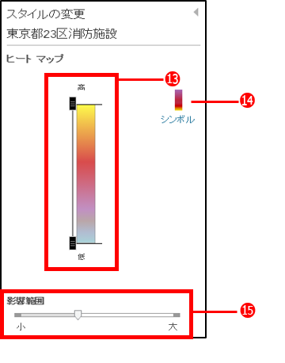
> 
> - ⓭ スライダーの上部、下部のバーを動かして、密集度の高いエリアや低いエリアを変更できます。
> - ⓮ 色のパターンを選択できます。
> - ⓯ スライダーを左右に動かして、影響範囲を変更できます。

7.	各パネルにおいて [OK]   をクリックし、[完了]   をクリックします。

### 二種類の属性フィールドによるシンボル設定

8.	一つ目の属性フィールドを選択すると表示される、[属性の追加]   をクリックします。
> ※数値型および文字列型のフィールド タイプを持つレイヤーに対してのみ、 [属性の追加] が表示されます。
> ここで、二つ目の属性フィールドを選択します。（一つ目に選択する属性フィールドを A、二つ目に選択する属性フィールドは B とします。）
> 
> 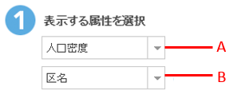

9.	 [②描画スタイルの選択] で、変更したい描画方法の [選択]   をクリックします。既に選択されている描画スタイルは [オプション] と表示されます。
> #### 色とサイズ
> 
> 
> 
> Ａの属性は、色の濃淡で数値を表現し、Bの属性に対してはシンボルのサイズで数値を表現します。
> 選択した属性フィールドが日付型の場合は、時系列表示のシンボル設定がおこなえます。
> 
> #### 色 (期間) とサイズ
> 
> 
> 
> A の属性は、期間を色の濃淡で表現し、B の属性に対しては日付の新旧をシンボルのサイズで表現します。
> 
> #### 色とサイズ (期間)
> 
> 
> 
> A の属性は、日付の新旧をシンボルのサイズで表現し、B の属性に対しては期間を色の濃淡で表現します。
> 
> #### A を B と比較
> 
> 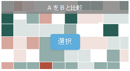
> 
> Bの属性に対し、Ａの属性の比率や割合を表現します。また、二つの属性の合計に対するAの属性の割合を表示します。
> 
> #### タイプとサイズ
> 
> 
> 
> 一意のシンボル（個別値）をサイズで表現します。A、B どちらかが文字列型の属性である場合は、文字列型の属性の方に個別値シンボルが自動的に適用され、他方の属性にサイズが適用されます。
> 選択した属性フィールドが日付型の場合は、時系列表示のシンボル設定がおこなえます。
> 
> #### タイプとサイズ (期間)
> 
> 
> 
> 一意のシンボル（個別値）ごとに期間の長さをシンボルの大きさで表現します。 A、B どちらかが文字列型の属性である場合は、その属性の方に個別値シンボルが自動的に適用され、日付型の属性にサイズが適用されます。
> 
> #### 主要カテゴリ
> 
> 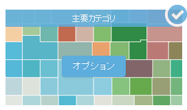
> 
> 複数の属性フィールドの値を比較して、一番高い値を持つ属性フィールドに設定した色を表示します。同時に、他の値と比べてどれほど優位かを透過で表現します。
> 
> #### 主要カテゴリおよびサイズ
> 
> 
> 
> 上記の「主要カテゴリ」に加え、複数の属性値の合計を円の大きさで表します。

10.	[オプション] をクリックすると、シンボルの詳細な設定をすることができます。

11.	設定後、各パネルにおいて [OK]   をクリックし、[完了]   をクリックします。
> ※独自のシンボルを表示したい場合は、シンボルとして表示させたい
> 画像をあらかじめWeb 上にアップロードしておき、[スタイルの変更]
> パネル → [場所（単一シンボル）] あるいは [種類（個別値シンボル）] → 
> [選択] → [オプション] で、シンボルをクリックし、[画像の使用] を
> クリックします。参照する URL をボックス内に入力し、プラスマーク
> をクリックすると、独自のシンボルとして利用することができます。
> 
> 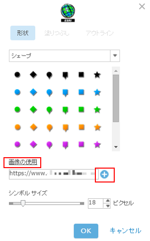

